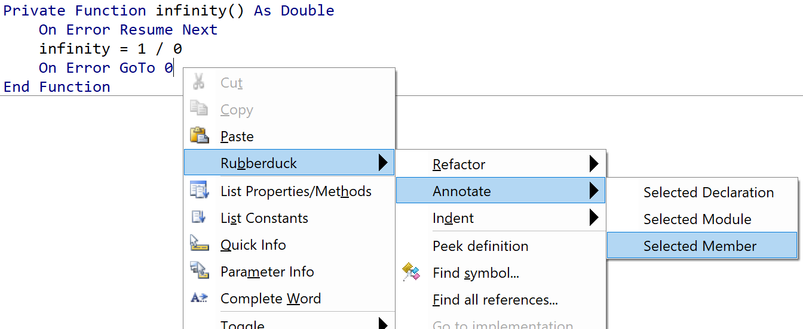
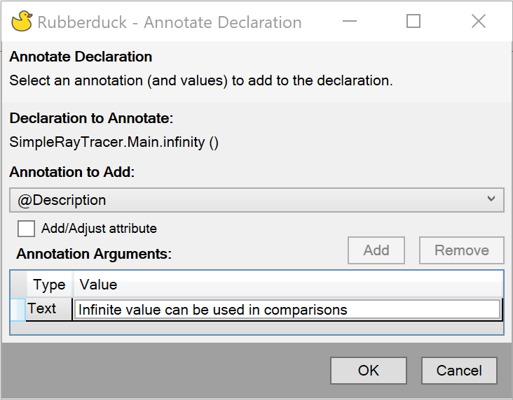

This menu exposes all annotations, so you don't need to memorize every supported Rubberduck annotation, their respective parameters, or where to put them.

Access is through the context menu, so right-click on the relevent area in the code pane, then select **Rubberduck -> Annotate -> Selected ...**

The annotation dialog box will be brought up. Select the annotation to apply from the drop-down menu. The dialog box will guide you to add any extra required information such as the text description for the `@Description` annotation or the inspection type to ignore for the `@Ignore` annotation.

