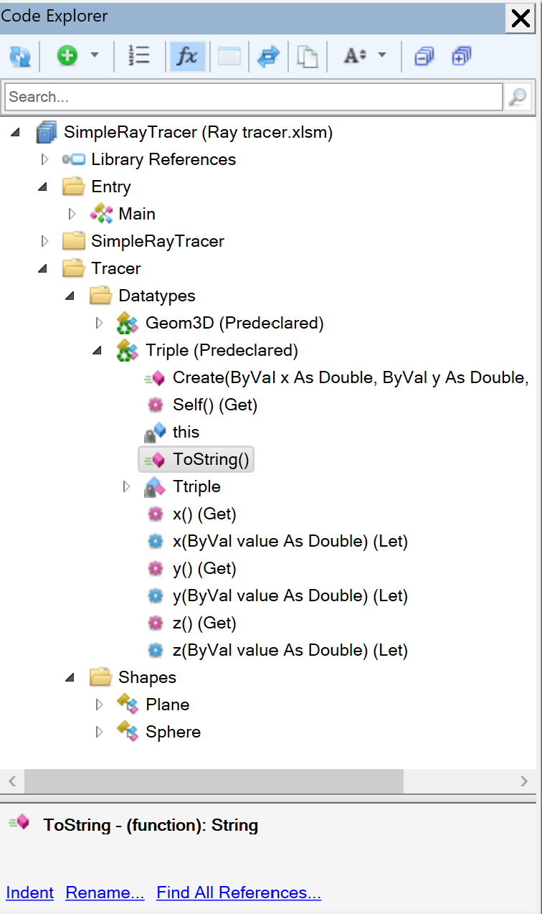
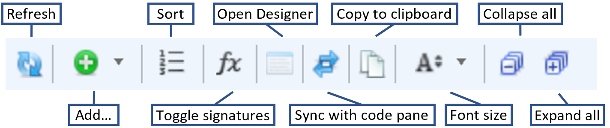

The **Code Explorer** tool window provides a lot of functionality. It is similar to the built-in **Project Explorer** but adds many new features and integration with Rubberduck's capabilities.

Example view of the Code Explorer:

The explorer has four main sections, starting from the top:
 - A toolbar to perform various actions and change the view of the tree view
 - A search box provides filtering the tree view by name
 - The tree view shows the library references and the project modules and classes
 - An information panel at the bottom

#### Toolbar

 - Refresh: 
 - Add...:
 - Sort:
 - Toggle signatures: 
 - Open Designer: 
 - Sync with code pane: 
 - Copy to clipboard: 
 - Font size: 
 - Collapse all: 
 - Expand all: 

#### Search
Just start typing and the tree view will dynamically adjust to only show matching items.

#### Tree view
The tree view is an expandable folder representation of the library references and code / forms in each open project. 

The folder structure will follow Rubberduck's `@folder` annotation, allowing for multiple top-level folders and nested folders. 

Each code module can also be expanded to show the top-level items in each module, e.g. constants, types and procedures. Types and enums can be further expanded to show their components.

Right-click items in the tree view to get a context menu for performing further actions e.g. adding an annotation or peeking the definition without navigating to the code.

#### Information panel
Shows further details on the selected item and provides convenient access to the indent, rename or find references to the selected item.