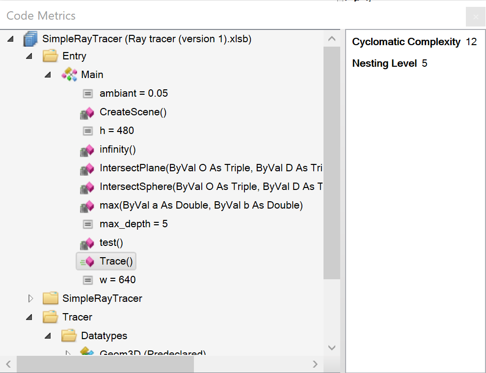

While the metrics themselves are objective, their interpretation and what actions they warrant are always subjective.

### Line Count

What it says on the tin: simply the number of lines (excluding comments and non-executable code) in a given scope. Ideally this figure remains under 10 or 20 everywhere, so that any given procedure scope always fully fits a single screen.

### Cyclomatic Complexity

Rubberduck calculates a _cyclomatic complexity_ 
(CC) metric for every procedure scope. This figure represents, roughly, the number of different possible execution paths in a scope. The ideal value is 1, but a procedure with a CC between 3 and 5 is usually deemed reasonably maintainable. Conversely, a procedure with a CC metric in the high 40s is a clear opportunity for refactoring.

### Example

The code metrics results window presents a tree view of your project. Expand and click on a module to see the line count and a procedure to see the cyclomatic complexity and nesting level.

