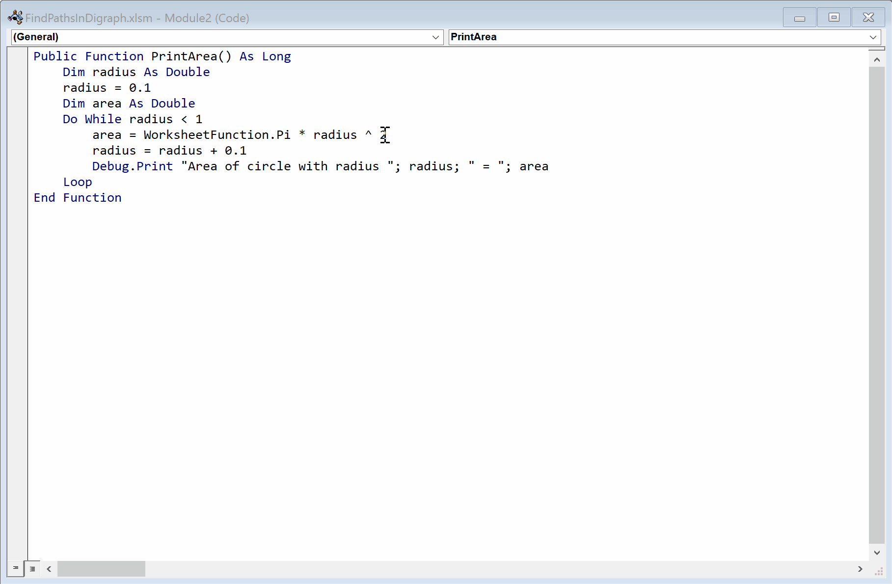

The extract method refactoring is useful for breaking up large procedures into smaller methods which can help with code readability and reusability.

Select the code to extract to a new procedure by right-clicking a selection of code then choosing `Rubberduck -> Refactor -> Extract Method`. This refactoring replaces the selected code with a call to the extracted method, passing in any parameters, and cleaning up any local variable declarations that are no longer needed. Rubberduck will preview the new method, allow you to set the new method name, and optionally allow you to specify a return parameter.

The below simple example shows how a single line of code can be refactored to a new function.

The code produced should still work after the refactoring but it is advisable to test immediately after any refactoring to make sure nothing has broken. If it is impossible to refactor a certain selection of code, then Rubberduck will in many cases show an error message explaining why it is not possible instead of allowing the refactoring. For example, if the selected code includes a `GoTo` statement, this is not allowed as `GoTo` only reaches code within the same procedure.