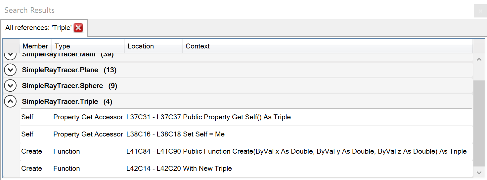

Using _find all references_ on a variable, procedure, type, enum or class will bring up a list of all refernces to that item. References are grouped by module and show the location and code context. Double click on any reference to navigate to it in the code window.

Example search results window for a reference to the class called `Triple`:

In all cases, when there is only a single result, Rubberduck navigates directly to it rather than showing a _search results_ list that only contains a single item.