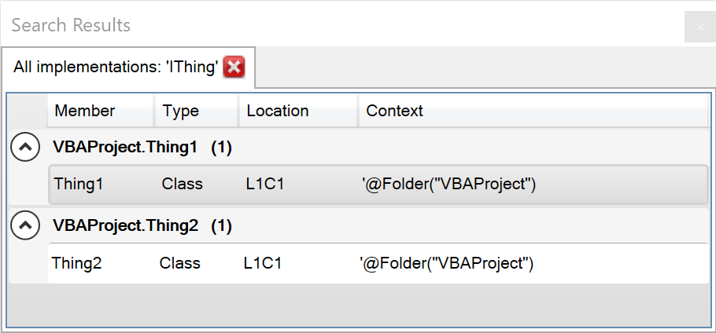

When coding against _abstractions_, the inherent decoupling between object types can make it hard to tell exactly what code is being invoked, especially when an interface has multiple implementations.

For example reading `Thing.DoStuff` in the below snippet tells you you're invoking a member against an object that implements the `IThing` interface, but then standard tooling such as _go to definition_ would only take you to the abstract definition:

<code>
Public Sub DoSomething(ByVal Thing As IThing)
    Thing.DoStuff
End Sub
</code>

Using _find all implementations_ on `IThing` would bring up all classes that implement this interface; using the same command on `DoStuff` would take you directly to the concrete implementations of that particular member.

Example search results window:

In all cases, when there is only a single result, Rubberduck navigates directly to it rather than showing a _search results_ list that only contains a single item.