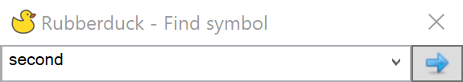
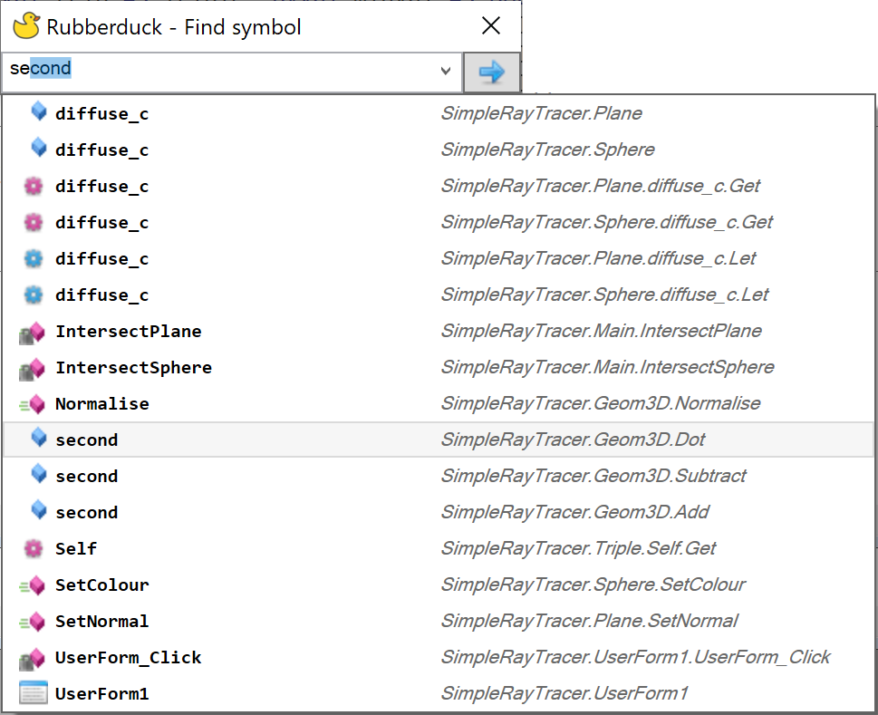

The find symbol command makes it easy to find and navigate to where any symbol is defined, whether it is a variable, parameter, enum, procedure or module. It is accessible via **Rubberduck -> Navigate -> Find symbol...** or simply by pressing `Ctrl-t`.

Type the symbol you are looking for. Text autocompletion will display if a match is found, then you can press *Enter* or press the blue arrow to do to the definition.

You can also expand the search box via the down arrow to the right. As you type, matching symbol definitions will be displayed in a list, along with their location in the project.

