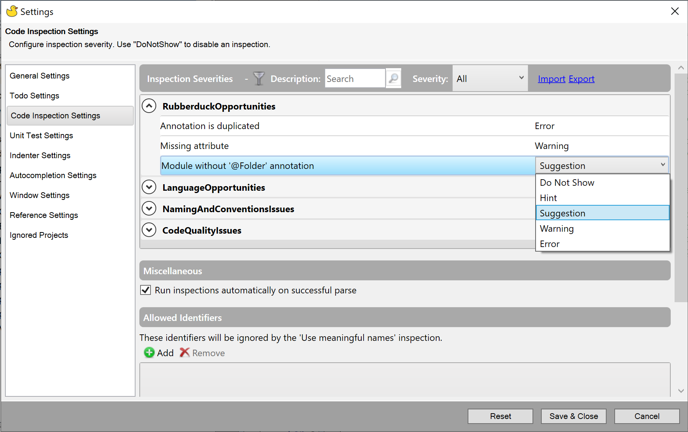

The code inspections toolwindow presents the inspection results grouped by module by default. 

### Example screenshot

### Usage

To understand an inspection in more detail, click once on the item and a brief description will appear in the box at the bottom of the window along with a link to the Rubberduck website for more detail. 

Double click an inspection to navigate to the location in the code which has triggered the inspection.

The toolbar provides options for grouping, filtering and searching the list of inspections. You can also expand or collapse all groups, copy the results to the clipboard and access the settings.

### Quick fixes

Rubberduck includes quick fix options for many inspection types. Click on the **Fix** button in the toolbar to see the options as a drop-down menu. If a fix is available, then the first menu item will describe the fix, from there you can choose to fix the selected occurrence or multiple occurrences.

You can also choose to ignore a particular inspection. This will add annotations telling Rubberduck to exclude these from the results. The annotation can applied at either the module level or at the level of the item triggering the inspection. 

### Settings

You can customize the severity category of an inspection or tell Rubberduck not to show it at all. Click on the severity level next to each inspection to get a drop-down menu with the options.

If inspections are causing any slow-down, you can choose to disable running inspections automatically on a successful parse. The inspections can then be manually run via the refresh button on the inspections results window toolbar.

The _Use meaningful names_ inspection looks for names matching certain criteria such as repeated characters or ending with a number. You can exclude specific names from the inspection results by adding them to the **Allowed Identifiers** section.

