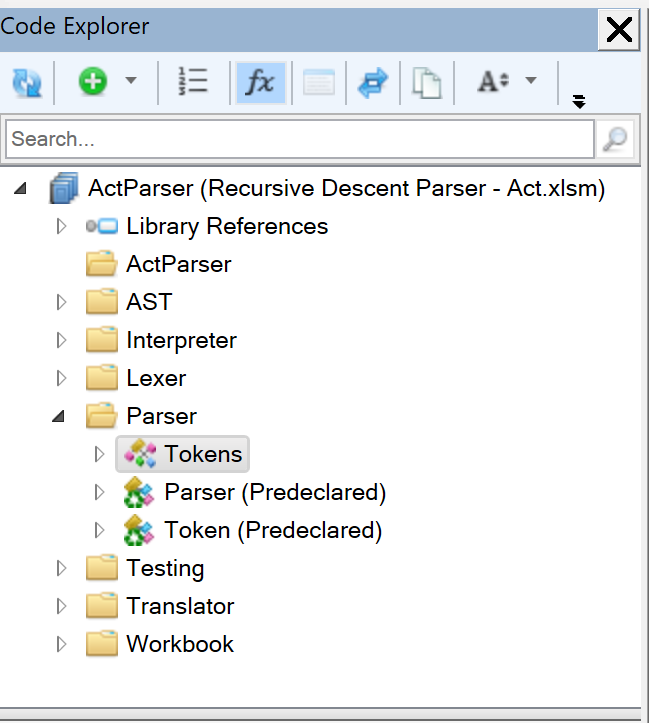
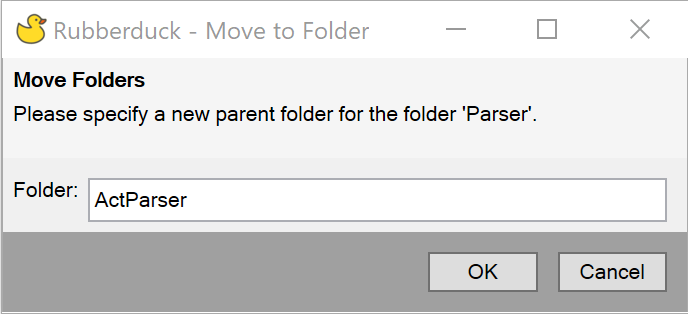
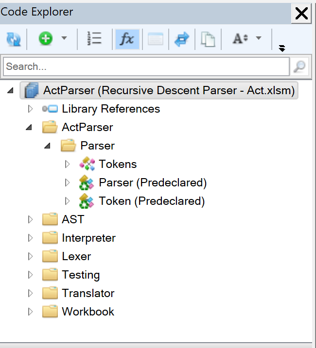

Rubberduck can help update the folder structure for your modules. This refactoring takes a module and moves the folder it is currently in to another folder. Any other modules in the same current folder will be moved as well since we are moving the containg folder.

For example, the below view of a project has a flat structure with multiple folders at the base level. We want to move the **Parser** folder to be within the **ActParser** folder.

Before view:

The first step is to open one of the modules within the **Parser** folder. In this case, we have double-clicked "Tokens" to open it. Then we go to `Rubberduck -> Refactor -> Move Containing Folder`. Rubberduck will present us with the following dialog box where you can type the name of the containing folder. This can be an existing folder or a new one which will be created automatically.

After entering "ActParser" as the containing folder name, we see that the **Parser** folder has been moved to be a child of the **ActParser** folder as desired and all the modules within the **Parser** folder show correctly in the new hierarchy:

