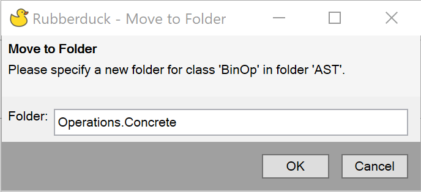

Rubberduck can move a module into a folder for you. This can be an existing folder or a new one.

To start, open one the module that you want to move and then select `Rubberduck -> Refactor -> Move To Folder`. Rubberduck will present the following dialog box where you can type the name of the containing folder.

The name of the folder follows the rules for the @folder annotation. As in the example image above, the module will be moved into a folder named **Concreate** which is within another folder named **Operations**.