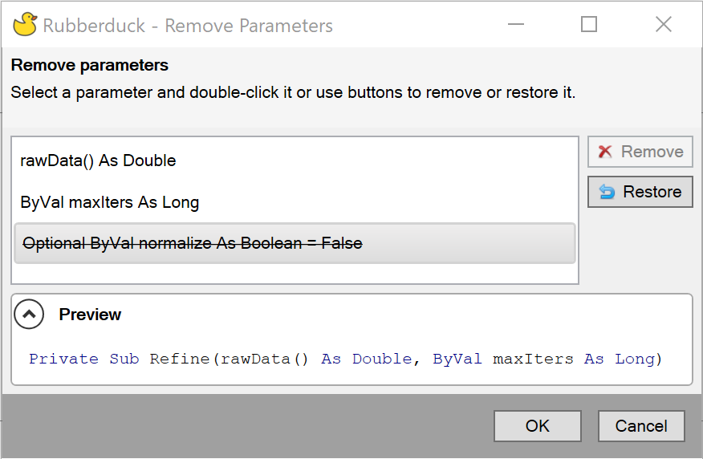

This refactoring provides a user interface to remove parameters from a method. This can be used with functions, subs, property get/set/let and events.

To activate the refactoring, after parsing, click anywhere in the method then go to `Rubberduck -> Refactor -> Remove Parameters`. 

### Example
We apply the refactoring to a `Sub` with the following signature:
```
Private Sub Refine(rawData() As Double, ByVal maxIters As Long, Optional ByVal normalize As Boolean = False)
```

Rubberduck will then present a dialog box which lists all the parameters in the current method signature and a preview of the signature after the refactoring. Click on a parameter and double-click it or use the buttons to remove or restore it. Multiple parameters can be removed.
