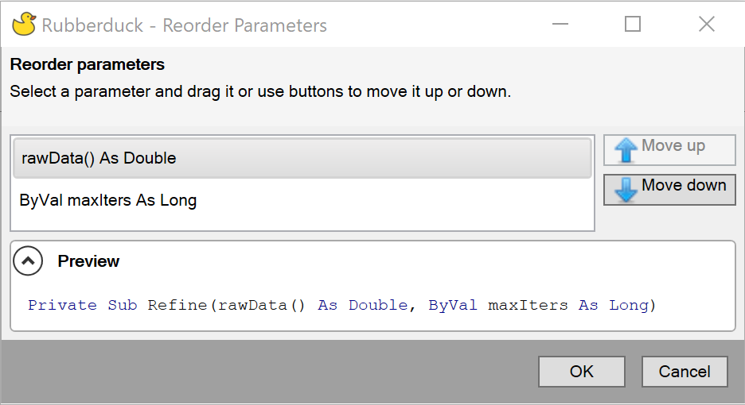

This refactoring provides a user interface to reorder the parameters of a method. This can be used with functions, subs, property get/set/let and events.

To activate the refactoring, after parsing, click anywhere in the method then go to `Rubberduck -> Refactor -> Reorder Parameters`. 

### Example
We apply the refactoring to a `Sub` with the following signature:
```
Private Sub Refine(rawData() As Double, ByVal maxIters As Long)
```

Rubberduck will then present a dialog box which lists all the parameters in the current method signature and a preview of the signature after the refactoring. Select a parameter and drag it or use buttons to move it up or down.
