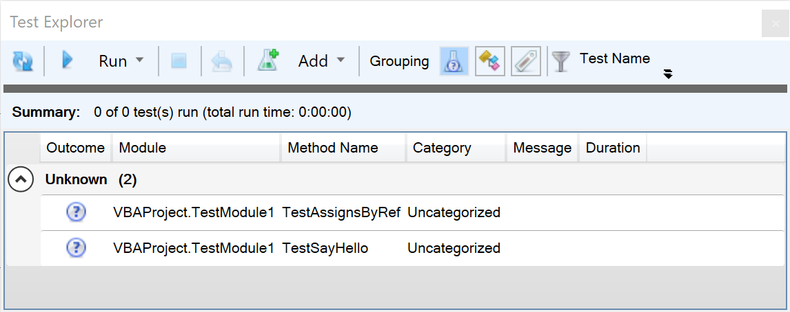
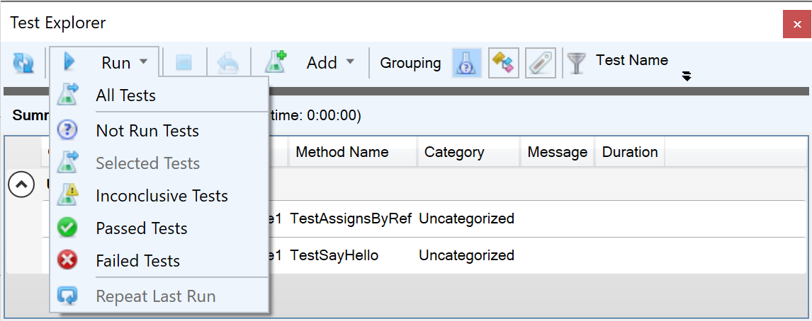
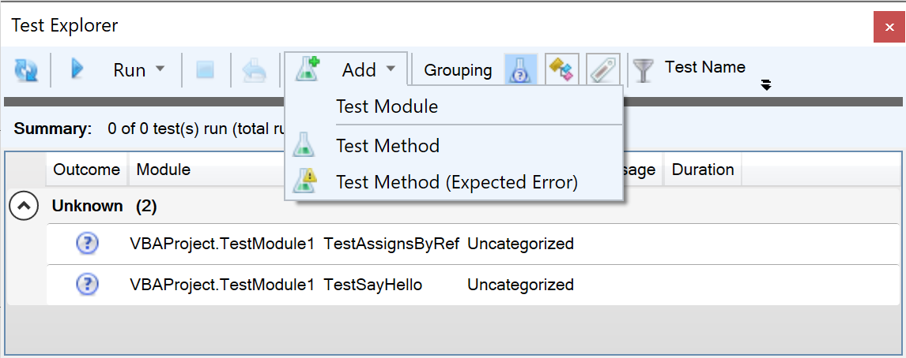

The _Test Explorer_ allows browsing/finding, running, and adding unit tests to the active VBProject:



### Usage

The **Refresh** button synchronizes the test methods with the code in the VBA editor, but if test methods are added from within the Test Explorer then the new tests will appear automatically.

The *Run* menu makes it convenient to run specific sets of tests:



"Selected Tests" refer to the selection in the grid, not in the IDE.

The *Add* menu makes it easy to add new tests and test modules:



Adding a Test Module adds a new standard code module with this boilerplate content:
```
'@TestModule
'@Folder("Tests")

Option Explicit
Option Private Module

Private Assert As Object
Private Fakes As Object

'@ModuleInitialize
Private Sub ModuleInitialize()
    'this method runs once per module.
    Set Assert = CreateObject("Rubberduck.AssertClass")
    Set Fakes = CreateObject("Rubberduck.FakesProvider")
End Sub

'@ModuleCleanup
Private Sub ModuleCleanup()
    'this method runs once per module.
    Set Assert = Nothing
    Set Fakes = Nothing
End Sub

'@TestInitialize
Private Sub TestInitialize()
    'This method runs before every test in the module..
End Sub

'@TestCleanup
Private Sub TestCleanup()
    'this method runs after every test in the module.
End Sub
```

The Assert and Fakes objects are late bound here. If you want to have the advantage of Intellisense, add a reference to the **Rubberduck AddIn** from the References menu and change the declarations from `Object` to `Rubberduck.AssertClass` and `Rubberduck.FakesProvider` respectively.

Adding a _Test Method_ adds this template snippet at the end of the active test module:
```
'@TestMethod("Uncategorized")
Private Sub TestMethod1()                        'TODO Rename test
    On Error GoTo TestFail
    
    'Arrange:
    
    'Act:
    
    'Assert:
    Assert.Succeed

TestExit:
    '@Ignore UnhandledOnErrorResumeNext
    On Error Resume Next
    
    Exit Sub
TestFail:
    Assert.Fail "Test raised an error: #" & Err.Number & " - " & Err.Description
    Resume TestExit
End Sub
```

Adding a _Test Method (expected error)_ adds this template snippet at the end of the active test module:

```
'@TestMethod("Uncategorized")
Private Sub TestMethod2()                        'TODO Rename test
    Const ExpectedError As Long = 0              'TODO Change to expected error number
    On Error GoTo TestFail
    
    'Arrange:
    
    'Act:
    
Assert:
    Assert.Fail "Expected error was not raised"

TestExit:
    Exit Sub
TestFail:
    If Err.Number = ExpectedError Then
        Resume TestExit
    Else
        Resume Assert
    End If
End Sub

```

The number at the end of the generated method name depends on the number of test methods in the test module.

