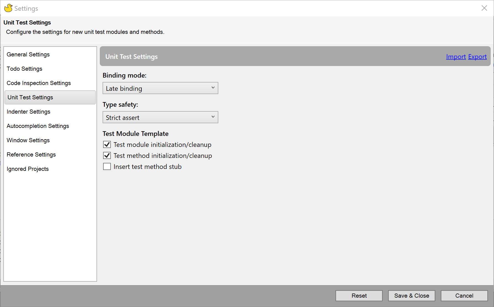
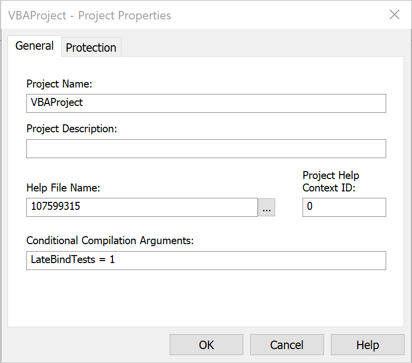

The _Unit Test Settings_ section of Rubberduck Settings can be used to configure how a new _Test Module_ will be created:

The _Binding mode_ controls whether the AssertsClass and FakesProvider are declared as `Object` or their actual types. If choosing _Early binding_ then a reference to the Rubberduck AddIn library will be created. Otherwise no reference is added. _Dual binding_ makes it easy to distribute a document which still has test modules included but doesn't require end users to have a reference to the Rubberduck AddIn library. The document developer can then benefit from early binding by setting `LateBindTests = 1` in the **Conditional Compilation Arguments** section of the project properties:

