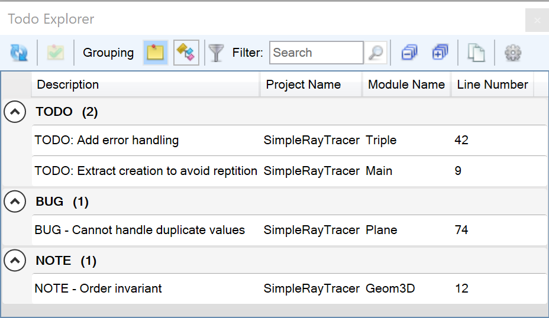
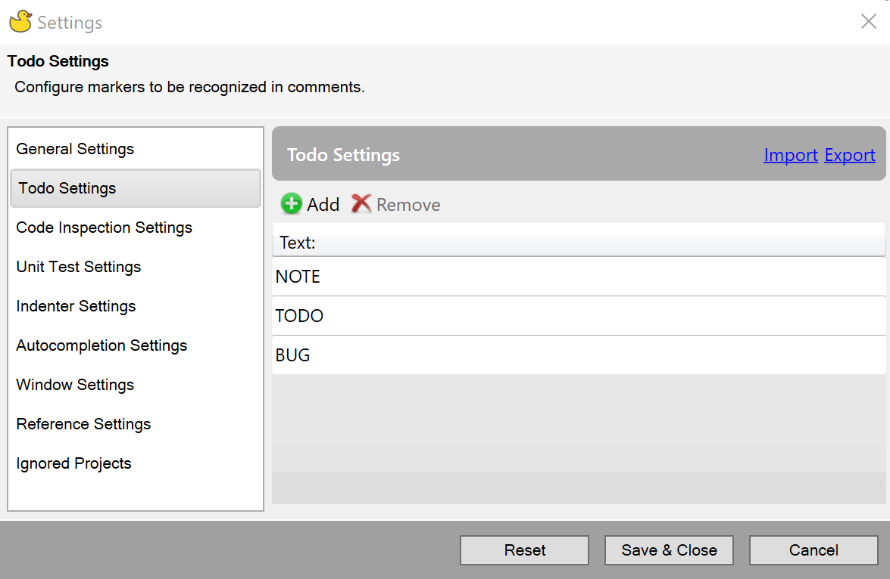

Rubberduck scans your projects for comments in a specific format and displays them in a separate window, making it easy to track things like bugs and tasks just by adding comments where they are noted.

By default, Rubberduck tracks comments starting with `TODO`, `BUG` or `NOTE`. For example:

<code>
'TODO: Add error handling
</code>

The **ToDo Explorer** window lists all the matching comments, as the example image below shows. You can also perform various actions from the tool bar including removing an item (which will remove the comment from the code), changing the grouping in the display, filtering results and copying results to the clipboard.

The comment markers can also be customized via the Rubberduck setting, where you can add or remove from the list of recognized markers:

